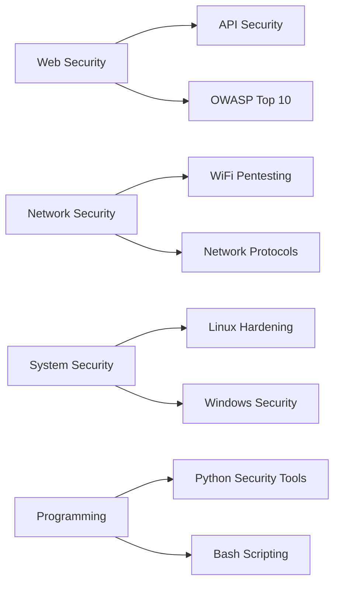

<div align="center">
  
</div>

<div align="center">
  
[](https://www.instagram.com/tuanmudazaky_/)
[](https://www.linkedin.com/in/misakiprananda)
[](https://discord.com/users/764657485327892531)
[](https://medium.com/@neverlandstudio)
[](mailto:arlianto032@gmail.com)

</div>

---

## 🚀 About Me

```yaml
Full Name: Muhammad Isaki Prananda
Role: Cybersecurity Student & Developer
Location: Malang, East Java, Indonesia
Education: SMKN 6 Malang - Computer and Network Engineering (TKJ)
Age: 17
Status: Learning, Building, Breaking (Ethically) 🛡️
Motto: "Security is not a product, but a process"
```


### 💫 Quick Facts

- 🔐 **Primary Focus**: Cybersecurity & Penetration Testing
- 🏴‍☠️ **CTF Enthusiast**: Web, Linux, Network, Cryptography challenges
- 💻 **Developer**: Building security tools and automation scripts
- 🌐 **Network Engineer**: TKJ specialization with hands-on experience
- 📚 **Continuous Learner**: Always exploring new vulnerabilities and techniques
- 🎯 **Goal**: Become a professional Security Researcher & Penetration Tester

### 🎯 Current Learning Path



---

## 🛠️ Technology Stack & Skills

<div align="center">

### 📊 Comprehensive Skills Matrix

</div>

<table>
<tr>
<td width="50%" valign="top">

#### 💻 **Programming Languages & Frameworks**

| Language/Framework | Proficiency | Use Case | Libraries/Tools |
|-------------------|-------------|----------|-----------------|
|  | ⭐⭐⭐⭐⭐ | Security Tools, Automation, Scripting, Machine Learning | Requests, BeautifulSoup, Scapy, Paramiko, Socket, Flask, Django, Pandas, NumPy |
|  | ⭐⭐⭐⭐⭐ | System Administration, Automation, Shell Scripts | AWK, SED, Grep, Cron, SystemD |
|  | ⭐⭐⭐⭐ | Web Development, XSS Testing, Frontend | Node.js, Express.js, React.js, jQuery, Axios |
|  | ⭐⭐⭐ | Type-safe Development, Large Applications | Angular, NestJS, TypeORM |
|  | ⭐⭐⭐⭐ | Backend Development, Web Apps, CMS | Laravel, CodeIgniter, WordPress, Composer |
|  | ⭐⭐⭐ | System Programming, Exploits, Low-level | GCC, GDB, Buffer Overflow, Memory Management |
|  | ⭐⭐⭐ | Performance-critical Apps, Game Dev | STL, Boost, Qt Framework |
|  | ⭐⭐⭐ | Enterprise Apps, Android Development | Spring Boot, Maven, Gradle, JUnit |
|  | ⭐⭐ | Cloud Services, Microservices, CLI Tools | Goroutines, Gin, Echo |
|  | ⭐⭐ | Memory-safe Systems, Security Tools | Cargo, Tokio, Actix-web |
|  | ⭐⭐ | Web Development, Scripting | Ruby on Rails, Sinatra, RSpec |
|  | ⭐⭐⭐ | Windows Automation, Active Directory | Cmdlets, Modules, DSC |
|  | ⭐⭐ | Text Processing, Legacy Systems | CPAN, Regex, CGI |

#### 🌐 **Web Technologies & Frontend**

| Technology | Proficiency | Use Case | Frameworks/Tools |
|-----------|-------------|----------|------------------|
|  | ⭐⭐⭐⭐⭐ | Web Structure, Semantic Markup | Canvas, WebGL, Web Components |
|  | ⭐⭐⭐⭐ | Web Styling, Responsive Design | Flexbox, Grid, Animations |
|  | ⭐⭐⭐ | CSS Preprocessing, Variables | SCSS, Mixins, Nesting |
|  | ⭐⭐⭐⭐ | Utility-first CSS Framework | JIT, Plugins, Custom Classes |
|  | ⭐⭐⭐⭐ | Responsive Framework, Components | Grid System, Icons, Utilities |
|  | ⭐⭐⭐⭐ | Single Page Applications, UI | Hooks, Redux, Context API |
|  | ⭐⭐⭐ | Progressive Framework, SPAs | Vuex, Vue Router, Composition API |
|  | ⭐⭐⭐ | Server-side Rendering, Static Sites | SSR, SSG, API Routes |
|  | ⭐⭐⭐⭐ | DOM Manipulation, AJAX | Plugins, Selectors, Effects |

#### 🗄️ **Database & Query Languages**

| Database | Proficiency | Use Case | Advanced Features |
|----------|-------------|----------|-------------------|
|  | ⭐⭐⭐⭐⭐ | Relational DB Management, SQLi Testing | Joins, Subqueries, Stored Procedures, Triggers |
|  | ⭐⭐⭐⭐ | Web Applications, LAMP Stack | InnoDB, Replication, Partitioning |
|  | ⭐⭐⭐ | Advanced SQL, GIS Applications | JSON Support, Full-text Search, PostGIS |
|  | ⭐⭐⭐ | NoSQL, Document Store | Aggregation, Sharding, Replication |
|  | ⭐⭐⭐ | Caching, Session Storage | Pub/Sub, Lua Scripting, Sorted Sets |
|  | ⭐⭐⭐⭐ | Embedded Database, Mobile Apps | Lightweight, File-based, ACID |
|  | ⭐⭐⭐ | MySQL Alternative, Open Source | Better Performance, More Features |
|  | ⭐⭐ | Enterprise Applications | PL/SQL, RAC, Data Guard |

#### 🔧 **Backend Frameworks & APIs**

| Framework | Proficiency | Language | Use Case |
|-----------|-------------|----------|----------|
|  | ⭐⭐⭐⭐ | Python | Microservices, REST APIs, Security Tools |
|  | ⭐⭐⭐ | Python | Full-stack Web Apps, ORM, Admin Panel |
|  | ⭐⭐⭐ | Python | High-performance APIs, Async, Auto Docs |
|  | ⭐⭐⭐⭐ | Node.js | RESTful APIs, Middleware, Routing |
|  | ⭐⭐⭐ | PHP | MVC Framework, Eloquent ORM, Artisan CLI |
|  | ⭐⭐ | Java | Enterprise Apps, Microservices |
|  | ⭐⭐⭐⭐⭐ | Various | API Design, CRUD Operations, Authentication |
|  | ⭐⭐⭐ | Various | Query Language, Single Endpoint |

#### 🔐 **Cybersecurity Domains**

| Domain | Proficiency | Focus Areas |
|--------|-------------|-------------|
|  | ⭐⭐⭐⭐ | XSS, SQLi, CSRF, SSRF, File Upload |
|  | ⭐⭐⭐⭐⭐ | Port Scanning, Packet Analysis, MITM |
|  | ⭐⭐⭐⭐ | Privilege Escalation, Hardening |
|  | ⭐⭐⭐ | Classical Ciphers, Modern Crypto |
|  | ⭐⭐⭐⭐ | Recon, Information Gathering |
|  | ⭐⭐⭐ | File Analysis, Memory Forensics |

#### 🛡️ **Security Frameworks & Methodologies**

| Framework | Application |
|-----------|-------------|
|  | Web Application Security Testing |
|  | Penetration Testing Methodology |
|  | Cybersecurity Framework |
|  | Threat Intelligence |

</td>
<td width="50%" valign="top">

#### 🔧 **Penetration Testing Tools**

| Category | Tools | Expertise |
|----------|-------|-----------|
| **Reconnaissance** |    | ⭐⭐⭐⭐⭐ |
| **Web Testing** |    | ⭐⭐⭐⭐ |
| **Exploitation** |    | ⭐⭐⭐⭐ |
| **Password Attacks** |    | ⭐⭐⭐⭐ |
| **Network Analysis** |    | ⭐⭐⭐⭐⭐ |
| **Wireless** |    | ⭐⭐⭐ |
| **Forensics** |    | ⭐⭐⭐ |

#### 🌐 **Networking & Infrastructure**

| Technology | Proficiency | Implementation |
|------------|-------------|----------------|
|  | ⭐⭐⭐⭐⭐ | Protocol Analysis, Troubleshooting |
|  | ⭐⭐⭐⭐ | Router Configuration, Firewall |
|  | ⭐⭐⭐⭐ | Switching, Routing, VLANs |
|  | ⭐⭐⭐ | Firewall, VPN, IDS/IPS |
|  | ⭐⭐⭐⭐ | Zone Management, DNSSEC |
|  | ⭐⭐⭐⭐ | IP Management, Leasing |
|  | ⭐⭐⭐⭐ | OpenVPN, WireGuard, IPSec |
|  | ⭐⭐⭐ | HAProxy, Nginx |

#### 💾 **Database & Backend**

| Database | Use Case | Proficiency |
|----------|----------|-------------|
|  | Relational DB, Web Apps | ⭐⭐⭐⭐ |
|  | Advanced SQL, Enterprise | ⭐⭐⭐ |
|  | NoSQL, Document Store | ⭐⭐⭐ |
|  | Caching, Session Storage | ⭐⭐⭐ |

#### ⚙️ **DevOps, Cloud & Development Tools**

| Tool/Platform | Purpose | Proficiency | Features |
|---------------|---------|-------------|----------|
|  | Version Control | ⭐⭐⭐⭐⭐ | Branching, Merging, Rebase, Cherry-pick |
|  | Code Repository, CI/CD | ⭐⭐⭐⭐⭐ | Actions, Pages, Projects, Issues |
|  | DevOps Platform | ⭐⭐⭐ | CI/CD Pipelines, Container Registry |
|  | Containerization | ⭐⭐⭐⭐ | Compose, Volumes, Networks, Multi-stage |
|  | Container Orchestration | ⭐⭐ | Pods, Services, Deployments |
|  | CI/CD Automation | ⭐⭐⭐ | Pipelines, Plugins, Build Jobs |
|  | Configuration Management | ⭐⭐⭐ | Playbooks, Roles, Inventory |
|  | Infrastructure as Code | ⭐⭐ | Modules, State Management |
|  | Cloud Platform | ⭐⭐⭐ | EC2, S3, Lambda, RDS, VPC |
|  | Cloud Platform | ⭐⭐ | Compute Engine, Cloud Storage |
|  | Cloud Platform | ⭐⭐ | Virtual Machines, App Service |
|  | Primary IDE | ⭐⭐⭐⭐⭐ | Extensions, Debug, GitLens, IntelliSense |
|  | Terminal Editor | ⭐⭐⭐⭐ | Plugins, Macros, Registers |
|  | Code Editor | ⭐⭐⭐ | Multiple Cursors, Goto Anything |
|  | Python IDE | ⭐⭐⭐ | Debugging, Testing, Django Support |
|  | Java IDE | ⭐⭐ | Smart Code Completion, Refactoring |
|  | API Testing | ⭐⭐⭐⭐ | Collections, Tests, Mock Servers |
|  | REST Client | ⭐⭐⭐ | GraphQL, gRPC Support |
|  | API Documentation | ⭐⭐⭐ | OpenAPI Specification, UI |
|  | Package Manager | ⭐⭐⭐⭐ | Scripts, Dependencies, Registry |
|  | Package Manager | ⭐⭐⭐ | Workspaces, Plug'n'Play |
|  | Python Package Manager | ⭐⭐⭐⭐⭐ | Virtual Environments, Requirements |
|  | PHP Package Manager | ⭐⭐⭐ | Autoloading, Dependencies |
|  | Module Bundler | ⭐⭐⭐ | Loaders, Plugins, Code Splitting |
|  | Build Tool | ⭐⭐⭐ | Fast HMR, Optimized Builds |
|  | Web Server | ⭐⭐⭐⭐ | Reverse Proxy, Load Balancing |
|  | Web Server | ⭐⭐⭐⭐ | Virtual Hosts, .htaccess, Modules |
|  | Development Environments | ⭐⭐⭐ | Provisioning, Multi-machine |
|  | Virtualization | ⭐⭐⭐⭐ | VM Management, Snapshots |
|  | Virtualization | ⭐⭐⭐ | Workstation, ESXi |

#### 📱 **Mobile Development**

| Platform | Proficiency | Frameworks/Tools |
|----------|-------------|------------------|
|  | ⭐⭐⭐ | Java, Kotlin, Android Studio |
|  | ⭐⭐ | Cross-platform, Expo |
|  | ⭐⭐ | Dart, Material Design |

#### 🎨 **Design & Multimedia Tools**

| Tool | Purpose | Proficiency |
|------|---------|-------------|
|  | UI/UX Design, Prototyping | ⭐⭐⭐ |
|  | Graphic Design, Social Media | ⭐⭐⭐⭐ |
|  | Image Editing | ⭐⭐⭐ |
|  | Image Manipulation | ⭐⭐⭐ |

</td>
</tr>
</table>

---

## 🏆 CTF & Security Achievements

<div align="center">

| Platform | Profile | Status |
|----------|---------|--------|
|  | Active Player | 🟢 Active |
|  | Learning Path | 🟢 Active |
|  | Competitor | 🟡 Seasonal |
|  | Wargames | 🟢 Active |

</div>

---

## 📊 GitHub Statistics
<div align="center">

  <table>
    <tr>
      <td width="50%" align="center">
        
      </td>
      <td width="50%" align="center">
        
      </td>
    </tr>
    <tr>
      <td width="50%" align="center">
        
      </td>
      <td width="50%" align="center">
        
      </td>
    </tr>
  </table>

</div>

<div align="center">
  
</div>

---

## 🎯 Current Projects

<table>
<tr>
<td width="50%">

### 🔐 Security Projects
- 🛡️ Custom Vulnerability Scanner
- 🔍 OSINT Automation Framework
- 🌐 Network Monitoring Dashboard
- 🐍 Python Security Toolbox

</td>
<td width="50%">

### 💻 Development Projects
- 🌐 CTF Challenge Platform
- 📝 Security Blog & Writeups
- 🤖 Telegram Security Bot
- 📚 Cybersecurity Learning Resources

</td>
</tr>
</table>

---

## 📫 Let's Connect!

<div align="center">

### 🤝 Open for Collaboration On:

```
✅ CTF Team Participation
✅ Security Research Projects
✅ Open Source Security Tools
✅ Knowledge Sharing & Mentoring
✅ Bug Bounty Hunting
```

### 💬 Ask Me About:

`Web Security` • `Network Pentesting` • `Linux Administration` • `CTF Strategies` • `Programming` • `Career in Cybersecurity`

</div>

---

<div align="center">

### 🐍 Contribution Snake


### 📈 Profile Views


</div>

---

<div align="center">
  
</div>

<div align="center">
  <i>⭐ Star my repositories if you find them interesting! ⭐</i>
</div>
